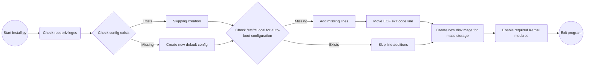

# Pwnbox

Set of tools and preconfigured software to turn a Raspberry Pi 4B into a well-equipped adversary including BadUSB.

### What is Pwnbox?
Pwnbox is a tool to use different types of USB configurations over OTG. 
It was developed for the Raspberry 4 and Zero variants.

### Can I run Pwnbox?
Only the Raspberry Pi 4 and Zero variants allow OTG over USB-C which is fundamental to get this working.
The older versions of the Raspberry Pi don't have a "slave" pin on their USB connectors.
Without this pin a host PC does not see the device as a valid USB Gadget.

### Which USB Gadgets are supported right now?

- HID
    - Raw
    - Keyboard
    - Mouse

- Ethernet
    - RNDIS
    - CDC/ECM

- Mass Storage

### Platforms

| Board | Supported | Raspbian | Ubuntu | CentOS
|---|---|---|---|---|
| Raspberry Pi 1 | No | Unsupported | Unsupported | Unsupported
| Raspberry Pi 1B | No | Unsupported | Unsupported | Unsupported
| Raspberry Pi 2 | No | Unsupported | Unsupported | Unsupported
| Raspberry Pi 2B | No | Unsupported | Unsupported | Unsupported
| Raspberry Pi 3 | No | Unsupported | Unsupported | Unsupported
| Raspberry Pi 3B | No | Unsupported | Unsupported | Unsupported
| Raspberry Pi 4 | Yes | Working | Untested | Untested
| Raspberry Pi 4B | Yes | Working | Untested | Untested
| Raspberry Pi Zero | Theoratically | Untested | Untested | Untested
| Raspberry Pi Zero W | Theoratically | Untested | Untested | Untested
| Raspberry Pi Zero 2| Theoratically | Untested | Untested | Untested
| Raspberry Pi Zero 2W| Theoratically | Untested | Untested | Untested


## Installation

First clone this repository using the following command. Please note that recursive is needed to include the rubberducky payloads submodule made by [Hak5](https://github.com/hak5/usbrubberducky-payloads/).

```bash
git clone --recursive https://github.com/Stijnn/Pwnbox
```

Next install the required python modules using pip. Currently only flask is used for the webapp and termcolor for colors on the CLI.

```bash
sudo pip install termcolor flask
```

Now we need to run the install.py file. For this use the following command from the base of the directory.
This file will setup the base structure for the program. It will create a config file at ```/etc/pwnbox/pwncfg.ini```. This file will also add the webapp.py launch and config load to ```/etc/rc.local```. 

```bash
sudo python3 ./install.py
```

Now you should be all set and ready to start using the USB gadgets. Rebooting should start the pwnutils.py but it will not inherit any device yet. For that check out the configurations part.
That will show how to enable different devices and general settings.
## Configuration

Pwnbox uses multiple configurations which are located in different locations. Down below I will explain their use and how to edit them.

### pwncfg.ini
The first one is located at ```/etc/pwnbox/pwncfg.ini```. This is an INI file which has different devices available that can be loaded.

```ini
[TYPES]
keyboard = False
storage = False
cdc_ecm = False
rndis = False
mouse = False
```

Now to enable the selected device change the False to True. As an example I want to enable the Keyboard module.
I do this with the following config.

```ini
[TYPES]
keyboard = True
storage = False
cdc_ecm = False
rndis = False
mouse = False
```

You are not limited to enabling one gadget at the time. Multiple settings can be set to **True**.\
Note that when disabling all devices the gadget will overall fail to bind as there is no valid device attached.

### pwnutil.py

In the pwnutil.py there are multiple configurations available.

The first one is GADGET_CONFIG. This config is the overall config of the gadget and will tell the host OS what type of USB device we are.
In this case it is configured as a Universal Gadget Box.
More information on how to modify these values speaks for itself looking at the following link: https://devicehunt.com/all-usb-vendors.

Please edit with caution as this can screw with the drivers on the host OS.
```python
GADGET_CONFIG = dict({
    'idVendor'  : 0x1d6b,
    'idProduct' : 0x0104,
    'bcdDevice' : 0x0100,    
    'bcdUSB'    : 0x0200,
})
```

Next up we have the strings config. This config is responsible for meta-data and text. 0x409 is related to the en-US variant but you can include many more languages.
Feel free to edit all the settings however you want.
```python
STRINGS_CONFIG = dict({
    '0x409': {
        'serialnumber': "0xdeadbeef420024",
        'manufacturer': "Pwnbox Developer",
        'product': "Pwnbox Gadget Box"
    }
})
```

The last config in this file is the DEVICE_CONFIG. This config interfaces with the pwncfg.ini and the later on loaded classes.
Some classes have more meta-data as this will be configured post-creation.

| Field | Responsibility |
| --- | --- |
| should_enable | When this field is True this will enable the device during load procedure.
| proxy_type | This is the class instance that will be called during load procedure. For custom types use DeviceFactory as baseclass.
| add_to_tmp | When this field is True this will store a file to the /tmp/pwnbox/ folder after load using tmp_name. This is helpfull for HID devices so that you can find the name in /dev/ based on the given config name in the DeviceFactory class. For example: hid.usb0 translates into hidg0.
| ip | Deprecated, use /etc/network/interfaces.
| netmask | Deprecated, use /etc/network/interfaces.
| tmp_name | This is the filename of the loaded device. For example: keyboard translates into /tmp/pwnbox/keyboard.

```python
DEVICE_CONFIG = dict({
    'KEYBOARD': { 
        'should_enable': config.getboolean('TYPES', 'KEYBOARD'),
        'proxy_type': KeyboardFactory('hid.usb0'),
        'add_to_tmp': True,
        'tmp_name': 'keyboard'
    },
    'STORAGE': { 
        'should_enable': config.getboolean('TYPES', 'STORAGE'),
        'proxy_type': StorageFactory('mass_storage.usb0', f'{PWNBOX_PATH}/diskimage.img'),
        'add_to_tmp': False
    },
    'CDC_ECM': { 
        'should_enable': config.getboolean('TYPES', 'CDC_ECM'),
        'proxy_type': EthernetFactory('ecm.usb0'),
        'add_to_tmp': False,
        'ip': '192.168.4.1',
        'netmask': '255.255.255.0'
    },
    'RNDIS': { 
        'should_enable': config.getboolean('TYPES', 'RNDIS'),
        'proxy_type': RNDISFactory('rndis.usb0'),
        'add_to_tmp': False,
        'ip': '192.168.4.1',
        'netmask': '255.255.255.0'
    },
    'MOUSE': { 
        'should_enable': config.getboolean('TYPES', 'MOUSE'),
        'proxy_type': MouseFactory('hid.usb1'),
        'add_to_tmp': True,
        'tmp_name': 'mouse'
    }
})
```

### webapp.py

Last but not least we have webapp.py. This webapp runs on flask and you can configure the port in the main method.

By default it looks like the following code.
```python
def main():
    app.run('0.0.0.0', 5000)
    pass
```

If we want to use port 80 on for example IP ```127.0.0.1 (localhost)``` it looks like this:

```python
def main():
    app.run('127.0.0.1', 80)
    pass
```
## Usage

Pwnbox can be controlled in three ways. First we have ```pwnutil.py```. This python script is responsible for loading/unloading/disabling the gadgets.
You can interface with this utility using the command-line. 

Using the following help (-h) parameter the command-line will show the help page / information.
```bash
sudo python3 ./pwnutil.py -h
```
```bash
usage: pwnutil.py [-h] [--load] [--unload] [--disable] [--no-logging]

Pwnbox Command Line Interface Utility Program

optional arguments:
  -h, --help    show this help message and exit
  --load        Load gadget if unloaded.
  --unload      Unload gadget if loaded.
  --disable     Disable the gadget but dont unload
  --no-logging  Do not create a logfile
```
These are all the parameters available in the pwnutil.py tool.

### Pwnboxlib

The second method is using pwnboxlib that can be found and included in the python scripts. An example implementation using a keyboard can be found in test.py.
Lets have a look at how you can use the keyboard class.

First we have to include the keyboard module. We do that using the following code. We also import keytranslation. This module holds the virtual keys so you can reference them in code using the KEY_ specifier.
```python
from pwnboxlib.keyboard.keyboard import Keyboard
from pwnboxlib.keyboard.keytranslation import *
```

Once we have the classes imported we need to get the keyboard instance. We do this using ```Keyboard.get()```. This function will return None if the keyboard has not been loaded.
```python
kb = Keyboard.get()
if kb == None:
    sys.exit()
```

So now we got our keyboard instance and we can start calling its functions. We can press a single key using ```press_key(self, key: str, modifiers: List[str] = [KEY_NONE], release=True)```
```python
# We are calling the press_key method sending the WIN+R key in this example.
kb.press_key(KEY_R, [KEY_MOD_LMETA])

# You can also call keys without modifiers.
kb.press_key(KEY_R)

# You can also reset/flush the interrupt buffer using the following code. This prevents repeat of key use.
# By default release=True is set and thus this is not required. 
kb.press_key(KEY_NONE)

# When you want to set a HOLD on a specific key you can use the following code. You can reset this state using the previous example.
kb.press_key(KEY_R, release=False)
```

Next up we have the function ```write(self, text: str)```. You can pass a piece of text to this function and it will automatically type this text using the keyboard.
```python
# The following code will type out "Hello World!"
kb.write('Hello World!')
```

But there can be times where you want to write text and hit enter with as little downtime as possible. For this I created the following function ```write_line(self, text: str)```.
This function combines the press_key and write function to write text and press enter.

```python
# An example typing cmd and pressing enter.
kb.write_line('cmd')
```

As you may have noticed modifiers in the function press_key is of type List. This is because the modifiers is a flag type and can be multiple at once.
The different types are implemented in the keytranslation module and are prefixed with KEY_MOD_.

There are more functions available for different classes. Have a look at the different modules to see whats available.

### Webapp.py
This webapp runs on the given config. When navigating to the site you will see there are lots of different scripts in a list. These are buttons and clicking on them will execute the duckyscript on the Raspberry Pi. There is also an /extract endpoint available. This endpoint is a POST endpoint and can be used to POST data to during exfiltrations from the host OS.
The POST method accepts the x-application-form standard. Once data is received the method creates a new file under /extractions/ named extraction_ followed by a number increasing with each extraction. In this file it stores the posted form.

### Duckyscript Interpreter
Because there are many duckyscripts made available by Hak5 I wrote a DuckyscriptInterpreter. This class can be found in ```pwnboxlib/interpreter/duckyscriptinterpreter.py```

You can call this method using python3. As an example:
```python
DuckyScriptInterpeter.exec_script('path/to/the/script/payload')
```
This class uses a staticmethod so you do not have to instantiate a class object. It is advised to use an absolute path to the file.

You can also import the class from the python command-line.
```python
>>> from pwnboxlib.interpreter.duckyscriptinterpreter import DuckyScriptInterpeter
>>> DuckyScriptInterpeter.exec_script('path/to/the/script/payload')
```
## Designs

#### Install.py

## Credits

During this project various sources were used as a source of information.

| Author | Link |
| --- | --- |
| [Brian Benchoff](https://hackaday.com/author/brianbenchoff/) | https://hackaday.com/2016/02/25/giving-the-pi-zero-usb-ethernet-and-serial-over-usb/ | 
| [mame82](https://github.com/mame82) | https://github.com/RoganDawes/P4wnP1 |
| [Chris Kuethe](https://github.com/ckuethe) | https://github.com/ckuethe/usbarmory/wiki/USB-Gadgets |
| [USB Foundation](https://www.usb.org/) | https://www.usb.org/document-library/usb-20-specification |


## License

MIT License

Copyright (c) 2022 Stijn Verhelpen

Permission is hereby granted, free of charge, to any person obtaining a copy
of this software and associated documentation files (the "Software"), to deal
in the Software without restriction, including without limitation the rights
to use, copy, modify, merge, publish, distribute, sublicense, and/or sell
copies of the Software, and to permit persons to whom the Software is
furnished to do so, subject to the following conditions:

The above copyright notice and this permission notice shall be included in all
copies or substantial portions of the Software.

THE SOFTWARE IS PROVIDED "AS IS", WITHOUT WARRANTY OF ANY KIND, EXPRESS OR
IMPLIED, INCLUDING BUT NOT LIMITED TO THE WARRANTIES OF MERCHANTABILITY,
FITNESS FOR A PARTICULAR PURPOSE AND NONINFRINGEMENT. IN NO EVENT SHALL THE
AUTHORS OR COPYRIGHT HOLDERS BE LIABLE FOR ANY CLAIM, DAMAGES OR OTHER
LIABILITY, WHETHER IN AN ACTION OF CONTRACT, TORT OR OTHERWISE, ARISING FROM,
OUT OF OR IN CONNECTION WITH THE SOFTWARE OR THE USE OR OTHER DEALINGS IN THE
SOFTWARE.
